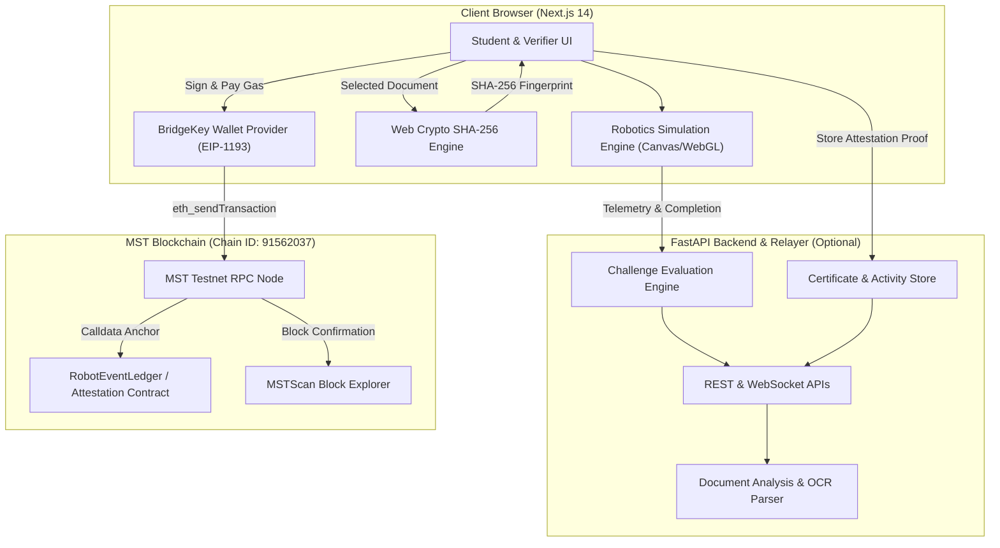

# RoboLab Chain

> **Blockchain-verified robotics learning and document credentials platform.**

RoboLab Chain combines virtual robotics simulation with tamper-proof decentralized credential attestation on the MST Blockchain. Students and engineers design, program, and evaluate autonomous mobile robots across interactive obstacle courses, while their educational milestones, performance metrics, and completion certificates are cryptographically fingerprinted using SHA-256 and anchored to the MST Testnet via the BridgeKey wallet.

---

## Overview

Modern engineering education requires verifiable proof of practical skill mastery. RoboLab Chain bridges the gap between hands-on robotics experimentation and decentralized identity verification:

- **Robotics Learning & Simulation**: An interactive robotics sandbox featuring LiDAR telemetry, obstacle avoidance, kinematic poses, and mission evaluation.
- **NEWRRO Robotics Domain**: Structured educational challenges and reactive robot controllers simulating AGV (Automated Guided Vehicle) navigation in warehouse environments.
- **Challenge Evaluation**: Algorithmic scoring evaluating collision-free trajectories, waypoint traversal efficiency, and mission execution time.
- **Blockchain Verification (MST Blockchain)**: Cryptographic state anchoring on the MST Blockchain (Chain ID: 91562037) ensuring that certificates, brand assets, and simulation event records cannot be altered or forged after issuance.
- **BridgeKey Native Integration**: Direct Web3 wallet interaction enabling students and certifiers to sign attestations and pay real testnet MST gas fees directly from the browser.

---

## Key Features

- **Virtual Robotics Lab**: 2D/3D reactive canvas simulation with live LiDAR beam scanning, obstacle collision detection, and autonomous waypoint navigation.
- **Robotics Challenges**: Multi-tier obstacle challenges (e.g. Warehouse Slalom, Maze Navigation, Hazard Evasion) with live telemetry tracking.
- **Code Editor & Controller Sandbox**: Python-like controller interfaces allowing reactive velocity control (`on_tick(robot, lidar)`) and dynamic world generation.
- **Live Telemetry & Diagnostics**: Real-time monitoring of heading angles, linear/angular velocity, LiDAR proximity rings, and battery performance.
- **Certificate & Credential Management**: Upload, display, share, and verify educational certificates and digital assets.
- **Browser-Side SHA-256 Fingerprinting**: Instant cryptographic hashing computed entirely in the client via the Web Crypto API in under 50ms.
- **On-Chain Document Anchoring**: Permanent registration of document fingerprints into MST Testnet transaction calldata via BridgeKey.
- **Public Credential Verifier**: Dedicated verification portal (`/verify`) enabling employers and academic institutions to drag-and-drop any PDF or image to confirm cryptographic authenticity against on-chain records.

---

## Architecture



---

## Robotics Lab

The virtual robotics lab models differential-drive AGVs navigating warehouse obstacle fields:

- **Kinematic Pose**: Tracks coordinate positions `(x, y)` and orientation `theta` (radians).
- **Simulated LiDAR**: 360-degree raycasted rangefinder returning distance-to-obstacle metrics across cardinal and intercardinal bearings.
- **Dynamic & Static Obstacles**: Stationary storage racks and moving hazards that oscillate along parameterized axes.
- **Telemetry Loop**: Simulation executes at 60 FPS (dt = 0.016s), delivering real-time telemetry updates.

---

## Blockchain Activity Logging: On-Chain vs. Off-Chain

To maintain high throughput while ensuring cryptographic integrity, RoboLab Chain strictly delineates on-chain and off-chain data:

| Data Type | Storage Location | Rationale |
| :--- | :--- | :--- |
| **Document Files & Images** | Off-chain (Local / Client) | Large binary assets are never stored on-chain to prevent bloat. |
| **Simulation Code & Replays** | Off-chain (Application / DB) | High-frequency telemetry streams are processed off-chain. |
| **Document SHA-256 Fingerprint** | **On-Chain (MST Testnet)** | Immutable proof of exact document state at registration time. |
| **Issuance Attestation Proof** | **On-Chain (MST Testnet)** | Transaction hash, block height, and signer address provide non-repudiation. |
| **Activity Event Hashes** | **On-Chain (MST Testnet)** | Verifiable state commitments for challenge completion. |

---

## Certificate & Document Verification

RoboLab Chain enables trustless, decentralized certificate verification:

```text
Upload Document 
      ↓
Browser computes SHA-256 in <50ms (Zero file upload needed for hashing)
      ↓
Query MST Testnet Registry & Calldata Ledger
      ↓
Compare Uploaded Fingerprint against On-Chain Record
      ↓
Instant Verification Verdict (VERIFIED / INVALID / NOT FOUND)
```

> **Cryptographic Principle**: A blockchain hash proves that the uploaded document is bit-for-bit identical to the record anchored by the issuer. It guarantees tamper-evident provenance since issuance.

---

## Tech Stack

- **Frontend**: Next.js 14 (App Router), React 18, TypeScript, Tailwind CSS, Lucide Icons, Web Crypto API.
- **Blockchain / Web3**: MST Testnet (Chain ID `91562037`), BridgeKey Wallet (EIP-1193), Hardhat, Solidity 0.8.20, OpenZeppelin Contracts.
- **Backend (Optional Microservice)**: FastAPI, Uvicorn, WebSockets, Python 3.10+, SQLAlchemy, Pydantic.
- **Simulation**: HTML5 Canvas, WebGL, custom 2D LiDAR raycaster.

---

## Project Structure

```text
mstxnewrro/
├── backend/
│   ├── alembic/              # Database migrations
│   ├── app/                  # FastAPI application modules
│   │   ├── api/routes/       # REST routes (blockchain, telemetry, robots)
│   │   ├── core/             # Configuration & security
│   │   ├── db/               # Database session & models
│   │   └── websocket/        # Real-time telemetry sockets
│   ├── Dockerfile
│   └── requirements.txt
├── frontend/
│   ├── src/
│   │   ├── app/              # Next.js App Router pages
│   │   │   ├── certificates/ # Certificate management & registration
│   │   │   ├── challenges/   # Robotics challenges
│   │   │   ├── robots/       # AGV fleet & digital twins
│   │   │   ├── simulation/   # 2D/3D robot simulator
│   │   │   └── verify/       # Public credential verification portal
│   │   ├── components/       # UI components & modals
│   │   ├── lib/              # Web3 client (mstBlockchain.ts), crypto utilities
│   │   ├── services/         # API services (certificateService, etc.)
│   │   └── types/            # TypeScript interfaces
│   ├── package.json
│   └── tsconfig.json
├── web3/
│   ├── contracts/            # Smart contracts (RobotEventLedger, RobotRegistry)
│   ├── scripts/              # Hardhat deployment scripts
│   ├── test/                 # Smart contract test suites
│   ├── hardhat.config.ts
│   └── package.json
├── .env.example              # Root environment template
├── CONTRIBUTING.md           # Contribution guidelines
├── LICENSE                   # MIT License
├── README.md                 # Project documentation
└── SECURITY.md               # Security & disclosure policy
```

---

## Getting Started

### Prerequisites

- Node.js (v18.17+ or v20+)
- npm (v9+)
- Python 3.10+ (for optional backend)
- **BridgeKey Browser Extension** (configured with MST Testnet)

---

### 1. Frontend Setup

```bash
cd frontend
npm install
cp .env.example .env.local
npm run dev
```

Open [http://localhost:3000](http://localhost:3000) in your browser.

---

### 2. Backend Setup (Optional)

```bash
cd backend
python -m venv .venv
# Linux/macOS:
source .venv/bin/activate
# Windows:
.venv\Scripts\activate

pip install -r requirements.txt
uvicorn app.main:app --reload --port 8000
```

---

### 3. Smart Contracts (Optional / Development)

```bash
cd web3
npm install
npx hardhat compile
```

---

## Environment Variables

Copy `.env.example` to `frontend/.env.local`:

```env
# MST Testnet RPC & Network Configuration
NEXT_PUBLIC_MST_RPC_URL=https://testnetrpc.mstblockchain.com
NEXT_PUBLIC_MST_CHAIN_ID=91562037
NEXT_PUBLIC_MST_NETWORK_NAME="MST Testnet (Chain ID: 91562037)"

# Smart Contract Addresses on MST Testnet
NEXT_PUBLIC_CONTRACT_ROBOT_EVENT_LEDGER=0xFf28A7c0524Be166b96aB215eE24Df3E939E9eEC
NEXT_PUBLIC_CONTRACT_ROBOT_REGISTRY=0x0E570aC03b653A453051F10b949eB4673E914348

# Explorer & Backend
NEXT_PUBLIC_BLOCK_EXPLORER_URL=https://testnet.mstscan.com
NEXT_PUBLIC_API_URL=http://localhost:8000
```

---

## MST Testnet & BridgeKey Configuration

To interact with the on-chain attestation ledger using BridgeKey:

| Parameter | Value |
| :--- | :--- |
| **Network Name** | MST Testnet |
| **RPC URL** | `https://testnetrpc.mstblockchain.com` |
| **Chain ID** | `91562037` (Hex: `0x5748805`) |
| **Currency Symbol** | `MST` |
| **Block Explorer** | `https://testnet.mstscan.com` |

---

## Security

- **Zero Client Secrets**: No private keys, mnemonics, or server credentials are exposed in the client repository.
- **Client-Side Hashing**: Documents never need to be uploaded to an external server just to compute an integrity hash; SHA-256 calculation happens directly inside the browser using standard Web Crypto.
- **Wallet Signature Verification**: On-chain anchor transactions are signed by the user's BridgeKey wallet using standard EIP-1193 protocols.

---

## Limitations

- **Assimilated Simulation**: The browser-based simulator is an educational digital-twin environment; it abstracts real-world physical dynamics like actuator back-EMF, wheel slippage, and complex sensor noise.
- **Assistive AI Analysis**: OCR and automated field extraction are designed to assist user workflow and do not replace formal identity audits.
- **Proof of Integrity vs. Truth**: Cryptographic hash matching confirms that a document has not been altered since its on-chain registration. It verifies data integrity, not the legal authenticity of claims made within the document.

---

## Future Improvements

- **ROS 2 Bridge**: Direct WebSocket bridge into real ROS 2 nodes running on physical TurtleBot or AMR hardware.
- **W3C Verifiable Credentials (VC)**: Export certificates formatted according to W3C Decentralized Identity (DID) specifications.
- **Multi-Robot Swarm Simulation**: Synchronized multi-agent warehouse dispatch challenges.
- **Zero-Knowledge Proofs**: Private verification proving course completion without exposing student names or identifiers publicly.

---

## Hackathon Context

Developed for the **BMSCE Hackathon**, integrating **NEWRRO** educational robotics scenarios with **MST Blockchain** decentralized verification infrastructure.

---

## License

This project is licensed under the **MIT License**. See the [LICENSE](LICENSE) file for details.

---

## Disclaimer

*RoboLab Chain is a hackathon prototype. Blockchain verification confirms the relationship between a document fingerprint and a registered blockchain record; it does not by itself establish that the original document was genuine.*
